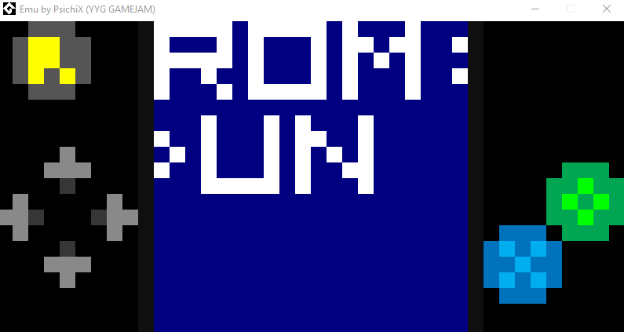
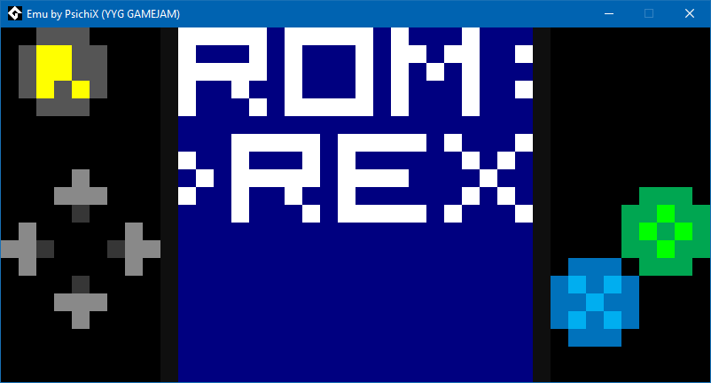
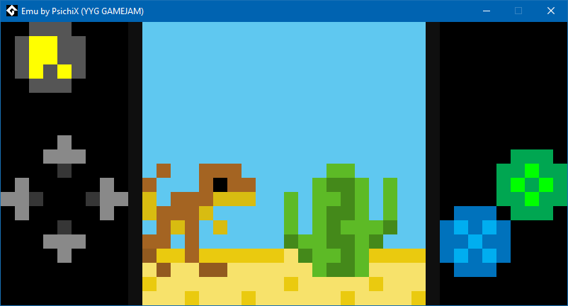

# Emu by PsichiX
### Game made for YYG gamejam 2019

## About
Emu is an oldschool game console emulator with very-lowres 20x20 display
(gamejam theme) that anyone can make a ROM game package for.

**NOTE:** All assets and code is written by me, as well as DLL emulator
dependency and its `Kaiju Toolset` dependency used to compile and run ROM game
code.

## Media

## Making ROM game package
- there must be a `manifest.json` file describing sprite atlas PNG location,
  sprites list and code entry file;
- there must be a sprite atlas PNG image with all graphics;
- ROM code must be written in Kaiju assembly language (all available ops are
  listed in `/emu-logic/src/opsdesc.txt`);
